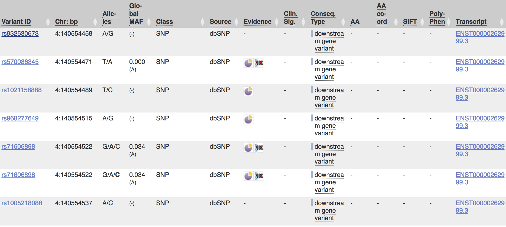
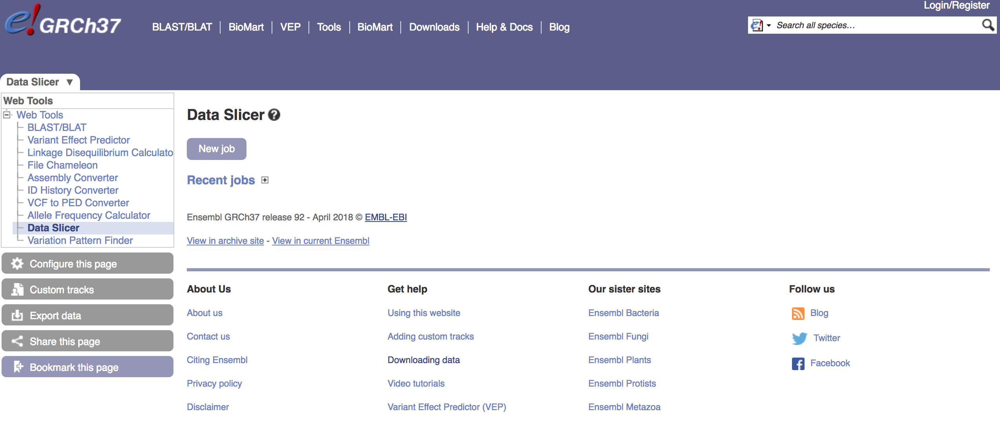
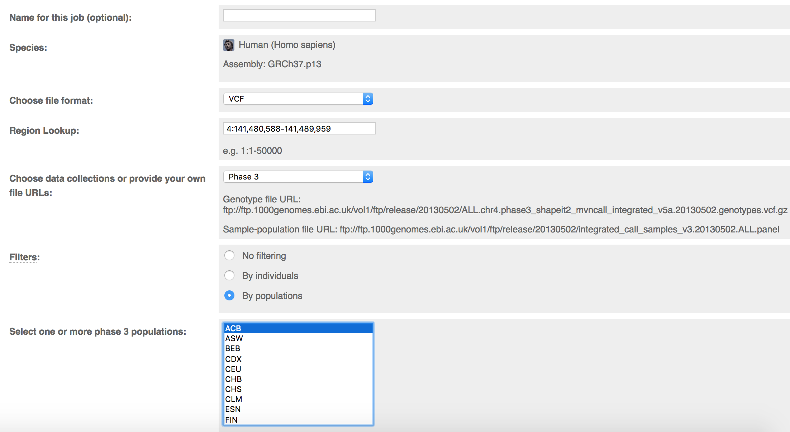

## Introduction to the International Genome Sample Resource (Formerly known as the 1000 Genomes Project)
 

 
 
 
The 1000 Genomes Project (1KG), which ran between 2008 and 2015, is what we could call a "catalogue of human variation." Essentially, it is a database of human genetic sequence from 26 distinct populations from around the world, which has been aligned to a human reference sequence. This data is free to use, and is an excellent resource for researchers who want to study genetic variation in a gene across populations, but cannot afford to collect their own samples. The 1KG project, had several phases in which they published their data; in their final phase (Phase 3), they had gathered samples from 2,504 individuals from the 26 populations. In 2015, the International Genome Sample Resource (IGSR) was established to "ensure the future usability and accessibility of the 1KG data." Some of the things the IGSR has done so far is re-mapped the Phase 3 data to the latest human reference sequence, GRCh38, incorporated published genomic data (such as RNA-seq data) in to their dataset, as well as begun the process of expanding the number of populations represented in the database. Below is a map of the current populations represented in the 1KG dataset, as well as reference list of the abbreviations used to identify the populations in the 1KG dataset that you can use throughout the labs.  
 
 

 
 
 

### Reference List of Current Populations Represented in the Dataset
 

* <b>CHB</b> - Han Chinese in Beijing, China
* <b>JPT</b> - Japanese in Tokyo, Japan
* <b>CHS</b> - Southern Han Chinese
* <b>CDX</b> - Chinese Dai in Xishuangbanna, China
* <b>KHV</b> - Kinh in Hi Chi Minh City, Vietnam
* <b>CEU</b> - Utah residents with Northern and Western European Ancestry
* <b>TSI</b> - Toscani in Italy
* <b>FIN</b> - Finnish in Finland
* <b>GBR</b> - British in England and Scotland
* <b>IBS</b> - Iberian Population in Spain
* <b>YRI</b> - Yoruba in Ibadan, Nigeria
* <b>LWK</b> - Luhya in Webuye, Kenya
* <b>GWD</b> - Gambian in Western Divisions in the Gambia
* <b>MSL</b> - Mende in Sierra Leone
* <b>ESN</b> - Esan in Nigeria
* <b>ASW</b> - Americans of African Ancestry in Southwest USA
* <b>ACB</b> - African Caribbeans in Barbados
* <b>MXL</b> - Mexican Ancestry from Los Angeles USA
* <b>PUR</b> - Puerto Ricans from Puerto Rico
* <b>CLM</b> - Columbians from Medellin, Columbia
* <b>PEL</b> - Peruvians from Lima, Peru
* <b>GIH</b> - Gujarati Indian from Houston, Texas
* <b>PJL</b> - Punjabi from Lahore, Pakistan
* <b>BEB</b> - Bengali from Bangladesh
* <b>STU</b> - Sri Lankan Tamil in the UK
* <b>ITU</b> - Undian Telugu in the UK
 
 

One last thing to note is that each of these populations falls under a "super population" which denotes the general area of the world each population is from. Many times, you will see information split up by these super populations instead of by each individual population. These super populations are as follows: 
 
 

* <b>AFR</b> - African
* <b>AMR</b> - Admixed American
* <b>EAS</b> - East Asian
* <b>EUR</b> - European
* <b>SAS</b> - South Asian
 
 

For more information about 1KG and IGSR, visit <http://www.internationalgenome.org/home>.
 
 
 

## A Brief Understanding the Bioinformatics Used To Create The 1KG Database
 
 
 
## Overview of the Variant Call Format (VCF) 
 

For the purposes of our class, we will be using VCF files to look at our candidate gene, UCP1. The VCF file format is, put simply, one of computer file formats that genetic information can be stored in. VCF files in particular are a way of formatting SNP-only information without having to deal with the rest of the sequence that the SNPs come from. Other file types, such as BAM files that contain information about every single base, have their own uses but for the purposes of our study (and most population genetics studies) they simply contain way more information than we need. Seriously, a BAM file containing an entire genome can be almost a terabyte (1000 gigabytes) in size! 
 
VCF files are a text-file format which can be opened with a plain text editor on your computer, and can be analyzed using various softwares (including VCFtools for Perl, which is what we will be using). Below I have included an example screenshot of what a VCF file looks like when opened in a plain text editor. 
 
 

 
 

As you can see from parts (b-g) of the figure, there is different notation that can be used depending on what type of SNP or variant position is being recorded. Don't worry though! You will not need to remember any of the notation used in VCF files, this is just here so you understand one way that SNP information is recorded, and what file type our software will use for the analyses. If you're interested in bioinformatics, there's more information about VCF files at <http://www.internationalgenome.org/wiki/Analysis/vcf4.0/>.
 
 

## How To Use Ensembl To Obtain VCF Information From The 1KG Dataset
 

Links to, and information for, all of the genome browsers that feature 1KG data is found here: <http://www.internationalgenome.org/1000-genomes-browsers>. 
 
 
As the 1KG project was running, 1KG had its own "eary access" genome browsers that allowed researchers to get detailed information about a specific gene of interest. These browsers, which are still available today, contain the open-access information that was updated with each phase of the project. However, these browsers are now outdated, and the most up-to-date genomic alignments for the 1KG project data are generated by Ensembl. Ensembl is a genome database that is maintained by the European Bioinformatics Instritute, and houses genomic data for many different species. Ensembl also has several different versions which are updated as new alignment information becomes available. For this class, we will be using the most up-to-date version of the Ensembl human geneome browser, the GRCh38 browser. Today we will use Ensembl to look at our gene of interest, UCP1. 
 
 

### Step-by-step Instructions for Using Ensembl
 

 
 

#### Step 1: Finding UCP1

* Go to the website: <http://useast.ensembl.org/Homo_sapiens/Info/Index>

* Find the search bar in the top left-hand corner and type in "UCP1." Make sure the "category" drop-down menu is set to "Search all categories." Click "go."
 

 

* The first result to come up should be called "UCP1 (Human Gene)" and should look like this: 
 

 

* Clicking on that will bring you to the "home page" for the gene UCP1, which will look like this: 
 
 

 
 
Congratulations, you've found your gene! Now, let's visually explore UCP1. 
 
 

#### Step 2: Visualizing UCP1 and its Variants

* If you scroll down on the first page, you will see an interactive map of the UCP1 region of the genome. 
 
 

 
 

If you click on the "Go to region in detail" option directly above this image, you will get a more detailed version of the image. If you're interested, you can do this on your own time, but we will not need to do that for the purposes of this class. What we will look at, however, is an image that shows all of the variants in UCP1. 
 

* To get to the variant image, simply go to the lefthand sidebar and look for the "Variant Image" tab under "Genetic Variation."
 
 

 
 

There, you will find an interactive image that looks like this: 
 
 

 
 

You can click on each little variant box as well, which will give you information about each SNP, such as its rs ID number, its location, and what kind of mutation it is: 
 
 

 
 

Feel free to play around with this image, but what will probably be more helpful is the variant table. 
 
 

* To get to the variant table, simply go to the tab in the lefthand sidebar that is above the one you are currently in, which will say "Variant Table"
 
 

 
 

You will get a table that looks like this: 
 
 

 
 

As you can see under the "Conseq. type" column, all of the variants at the top of the table are downstream variants. 
 
 
Let's do a little exercise, shall we? Above the table, there are some filtering options. Click on the "Consequences" filtering option and hit "Turn all off"
 
 

 
 

Now, turn back on all of the mutations that lie within the coding region of the gene AND will cause a change in genotype. Hint: I chose six types of mutation. After you're done choosing, hit "apply changes."
 
 
Now that we have a shortlist of SNPs that will actually come in handy for us, let's look at Global Minor Allele Frequency. 

(TBD if I actually need to write this part for this lab)
 
 

#### Step 3: Using the Data Slicer to Get VCF Data

Usually when you are working with genomic information, you are given a whole chromosome or even a whole genome's worth of information in either a BAM file or a VCF file. If you only need to look at one part of the genome, it can be very annoying to work with a lot of extra data. The Ensembl data slicer is a convenient way to get only the amount of data that you want without going in to a program and cutting it out yourself. Therefore, we will use this tool to get the data for our analysis of UCP1. 
 
 
One thing to note about the data slicer is that it is only available for the GRCh37 version of Ensembl, which is the version that came before the most current version that we have been using, GRCh38. This just means we will have to use the coordinates for the gene that were described in the GRCh37 version of the site, since the 1KG data was aligned to a different genome for each version of the site. Don't worry about finding the new coordinates, I will give them to you here.
 
 
The link to the data slicer is available here: <http://grch37.ensembl.org/Homo_sapiens/Tools/DataSlicer?db=core>. 
 
 
Now, on to the tutorial!

* Click on the link provided above. It will take you here: 
 
 

 
 

* Click "New job." You will get this interface: 
 
 

 
 

* First off, the file format should be set for VCF. If it's not, click the drop-down menu and select VCF. 

* In the "region lookup" bar, copy and paste in the location <b> 4:141,480,588-141,489,959</b>. These are the GRCh37 version alignment coordinates for the gene UCP1. 

* In in the "Choose data file" dropdown list, make sure "phase 3" is selected. This will ensure you get data from the last phase of the 1KG project. 

* In the "filters" category, select "By populations." This will give you a dropdown menu of all of the 1KG populations. Select the population that you were assigned, so that you only get the data for that population. 

* The filled-in interface should look like this: 
 
 

 
 

* Hit the "run" button at the bottom of the page. 

* This table will pop up, and will tell you when your job has been processed. Click "View results" to look at your results. 
 

 
 

* You will get this page: 
 

 
 

* Scroll down to the bottom of the results preview. Recall from earlier that there is a "head" and a "body" section of a VCF file. Check to make sure that the "body" of the file is there. It will look like this: 
 

 
 

We check our file to see if the body is there because sometimes the server will malfunction and give you only the head of the VCF file. If that happens, repeat the data slicer process. 
 

* Finally, hit the "Download results file" button. You will get a zipped file with your data, which we will work with in the next lab.  

### Congratulations, you now have your genetic data!

