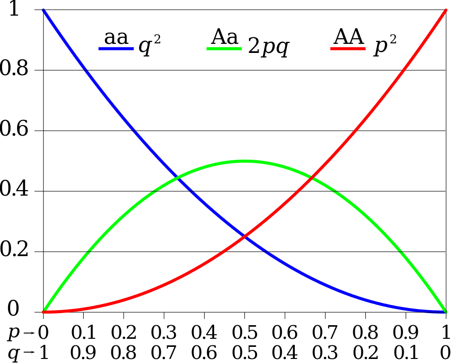

## Introduction to Hardy-Weinberg Equilibrium
 

We have already discussed Hardy-Weinberg Equilibrium in class, but let's go through a brief refresher before we dig in to this lab. So without further ado, let's learn about Hardy-Weinberg! 
 

### What is Hardy-Weinberg Equilibrium? 
  

Hardy-Weinberg Equilibrium simply states that genotype frequencies will remain the same between generations unless some sort of evolutionary influences are happening on the genotype. Hardy-Weinberg operates on five basic assumptions about the population: no mutation, random mating, no gene flow, infinite population size, and no selection is happening. Obviously some of these are impossible assumptions, but Hardy-Weinberg can still be a useful tool in determining if selection is happening on a population. 
 
  
Hardy-Weinberg Equilibrium can be represented mathematically with the equation: $p^{2}+2pq+q^{2}=1$, where $p^{2}$ represents the dominant-allele (or AA) homozygotes, $q^{2}$ represents the recessive-allele (or aa) homozygotes, and $2pq$ represents the heterozygotes. It is important to note that $p$ and $q$ don't represent the frequency of genotypes, they represent the frequency of each single allele in a population. Because the equation always has to equal 1, there is a proportional relationship between the allele frequencies. This relationship is represented by this graph: 
 
 

 
 
As you can see by this graph, if one allele, whether it be dominant or recessive, dominates in the population, there is no heterozygotes or homozygotes for the opposite allele to be found. But, the highest frequency that heterozygotes can reach in a population is 50%. Why do you think that is?
 

Now that we have gone over the basics of Hardy-Weinberg Equilibrium, we can start to look at how Hardy-Weinberg can be applied to current studies of population genetics. 

### Hardy-Weinberg Equilibrium in Population Genetics
 
In population genetics studies, you will often see Hardy-Weinberg Equilibrium being used to measure whether the observed genotype frequencies are the same as the estimated genotype frequencies. This is often accompanied byt eh ,jnfgd
